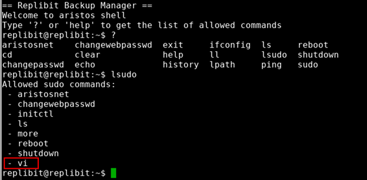
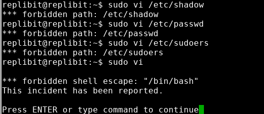
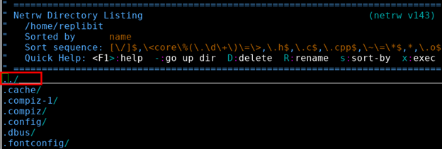
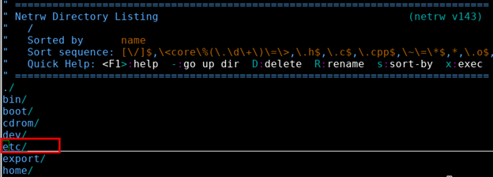
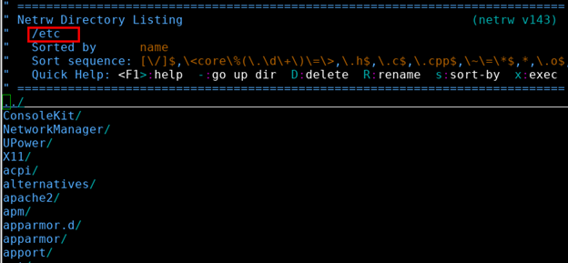

Replibit Backup Manager - Local Privilege Escalation
====================================================
**Date:** 2017-08-25  
**Exploit Author:** Wh1t3Rh1n0 (Michael Allen)  
**Exploit Author's Homepage:** http://www.mikeallen.org  
**Software Link:** http://replibit.com/  
**Version:** All versions prior to version 2017.08.04
**Link to Vulnerable Version:** https://mega.nz/#F!s3YiXYRT!QofXs7JA-Ub1FTBUrDDzIw

Disclosure Timeline
-------------------
2017-08-11 - Initial vendor notification.  
2017-08-11 - Initial vendor reply.  
2017-08-22 - Received notification that the issue has been fixed in the most recent version.  
2017-08-25 - Public disclosure.  

Vulnerability Description and Exploitation Process
--------------------------------------------------
After logging in to the built-in "replibit" account (default password, "replibit"), the user is presented with a restricted shell and has access to execute only a small subset of commands. Additionally, the user is also granted access to run some of these commands as the root user through the use of sudo. The text editor, "vi", is one of these commands.

A number of usual privilege escalation techniques which leverage vi are blocked, such as editing the /etc/shadow or /etc/passwd files or executing a shell command from within vi.

However, by executing <code>sudo vi ~</code>, the user can open their own home directory in vi and use the built-in functionality of vi to navigate the filesystem.

The user can then use the arrow keys and "Enter" key to repeatedly select the parent directory ("..") and navigate into /etc to access the /etc/passwd file or other sensitive files on the system:

With this access, a user can grant themselves root access in several different ways. One method, shown below, is to change the replibit user's UID to 0 (zero) and change their login shell to "/bin/bash". 

After making this change, the user is granted root access to the system on their next login.

